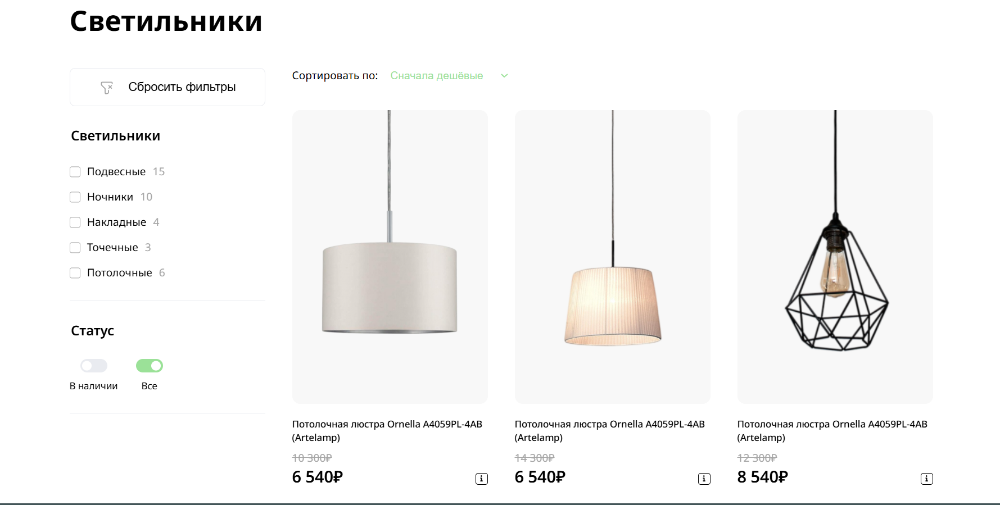

# Briaton - React + TypeScript

Финальное задание по курсам от Skillbox. Разработан как учебный и демонстрационный проект, переписанный на React + TypeScript.



## Стек технологий:
- **React**
- **TypesScript**
- **Antd Design**
- **SCSS**
- **JSON Server**

## Функционал:
- Список товаров с фильтрацией и сортировкой
- Поиск по категориям и наличию
- Открытие/закрытие "Ответы на частые вопросы от покупателей"(Accordion)
- Динамическая подгрузка данных через "fetch"

## Цель проека:
- Продемонстрировать навыки работы с React, TypeScript.

## Как запустить проект?
```bash

# Скопировать проект
git clone https://github.com/HELLRAID-cmd/Briaton.git

# Перейти в папку client
cd client

# Установить зависимости
npm i

# Запустить проект
npm run dev

# Запустить JSON server
npm run server
```

# Данный проект не оптимизирован под мобильные устройства, максимальная комфортная ширина просмотра - 1000px.
